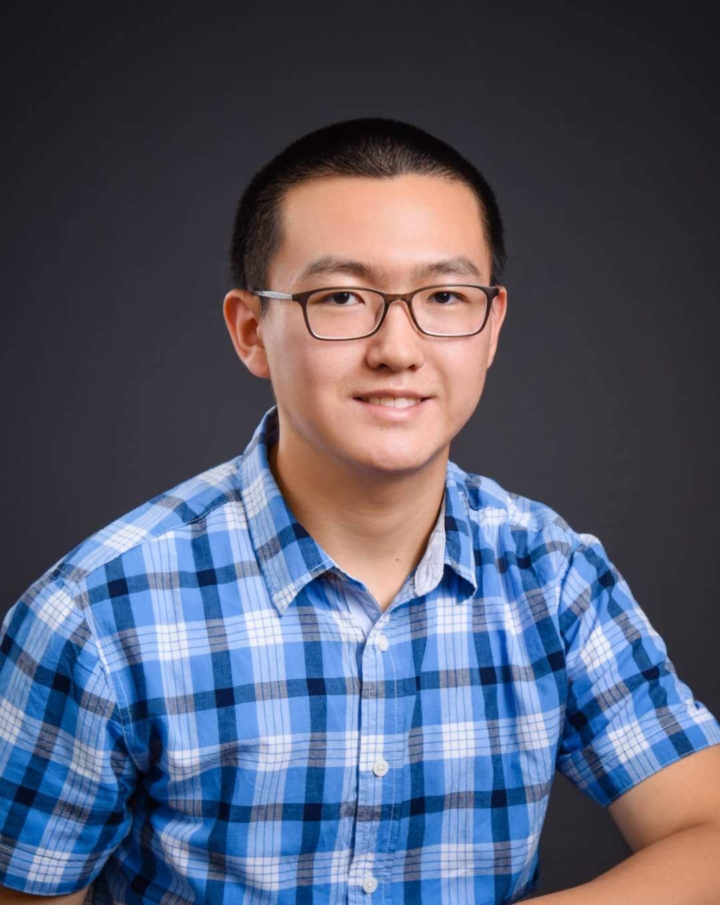

## About Me
I am a fourth-year B.S. candidate in [Mechanical Engineering](https://www.me.gatech.edu/) with a minor in [Computing & Intelligence](https://www.cc.gatech.edu/content/minor-computing-intelligence) at the [Georgia Institute of Technology](https://www.gatech.edu/) expected to graduate in Spring 2022. I am an undergraduate researcher with the [LIDAR Group](http://lab-idar.gatech.edu/) advised by [Prof. Ye Zhao](https://sites.google.com/site/yezhaout) and the [CORE Robotics Lab](https://core-robotics.gatech.edu/) advised by [Prof. Matthew Gombolay](https://core-robotics.gatech.edu/people/matthew-gombolay/). My current CV can be found [here](docs/John_Zhang_Curriculum_Vitae.pdf).

## Research
I am looking for PhD programs in Robotics and Computer Science starting in Fall 2022. I am broadly interested in expanding the boundaries of robot capabilities through intelligent planning, control, and learning. 

My undergraduate research focuses on motion planning for dynamic systems through both model-based trajectory optmization and data-driven/machine learning methods.

## News
**September 2021** Submitted our latest work titled *Mediating between Contact Feasibility and Robustness of Trajectory Optimization through Chance Complementarity Constraints* [[pdf]](http://lab-idar.gatech.edu/wp-content/uploads/Publications/Chance_Constrained_Robust_CITO_2021.pdf) [[code]](https://github.com/GTLIDAR/ChanceConstrainedRobustCITO)[[arXiv]](https://arxiv.org/abs/2105.09973) to [Frontiers in Robotics and AI](https://www.frontiersin.org/research-topics/25532/advancements-in-trajectory-optimization-and-model-predictive-control-for-legged-systems)

**July 2021** Presented our work entitled *Can Chance-Constrained Contact Uncertainty Quantification Improve Feasibility of Robust Trajectory Optimization?* at [Dynamic Walking 2021](https://www.dynamicwalking2021.org/) [[poster]](docs/Chance%20Constraint%20Poster.pdf)

**May 2021** Started internship with the xEV Dynamic Systems and Controls team at [Cummins](https://www.cummins.com/)

**March 2021** Sumbitted our research abstract on [Chance Constrained Robust Trajectory Optimization](http://lab-idar.gatech.edu/wp-content/uploads/Publications/DW2021_Chance_Constraint.pdf) to [Dynamic Walking](https://www.dynamicwalking2021.org/)

**November 2020** Accepted an SDE internship position at [Cummins Inc.](https://www.cummins.com/) for summer 2021

**November 2019** Received [President's Undergraduate Research Award](http://www.undergradresearch.gatech.edu/pura-salary) (PURA) Fellowship

**August 2018** Started undergrad at [Georgia Tech](https://www.gatech.edu/)

## Teaching
[ME 3017 System Dynamics](https://me.gatech.edu/files/ug/me3017.pdf) Fall 2020 - Present, TA

## Contact

**Email** zzhang741@gatech.edu

[**LinkedIn**](https://www.linkedin.com/in/john-zhang-01/)

**Phone** 215-460-8897
